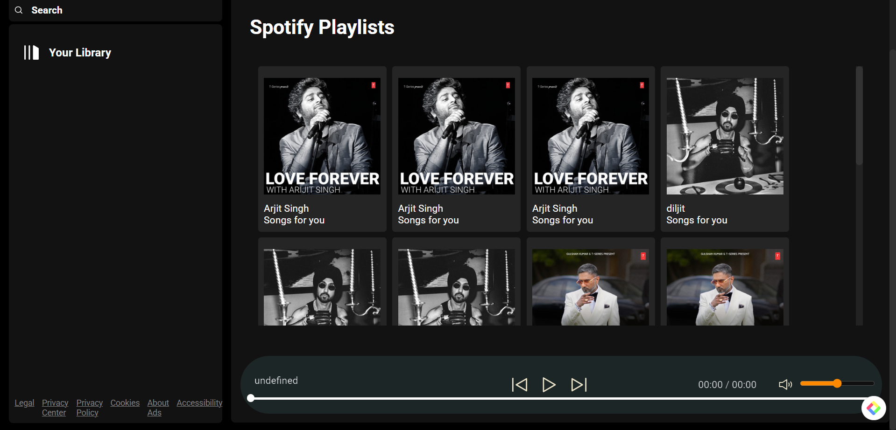

# 🎵 Spotify Music Player

A **simple frontend** music player inspired by Spotify, built using **HTML, CSS, and JavaScript**. Currently, it includes basic functionalities, and we plan to enhance it with more features in the future. 🚀  

---

## 🎨 UI Preview  


*(This is how the music player looks! 🎶)*

---

## 🌟 Features  
✔️ Play/Pause Music  
✔️ Next & Previous Song Controls  
✔️ Volume Control  
✔️ Basic UI inspired by Spotify  

---

## 🛠️ Technologies Used  
- **HTML** 🎨 - For structuring the player layout  
- **CSS** 🎭 - For styling and making it visually appealing  
- **JavaScript** ⚡ - For adding interactivity  

---

## 📌 Future Improvements  
🔹 Add a backend for user authentication & playlists  
🔹 Improve UI/UX with animations and responsiveness  
🔹 Implement a real music API for dynamic song fetching  
🔹 Introduce a dark/light mode  

---

## 🚀 How to Use  
1. Clone the repository:  
   ```sh
   git clone https://github.com/devAryagupta/spotifymusicplayer.git

---

## 🎨 UI Preview  


*(This is how the music player looks! 🎶)*

